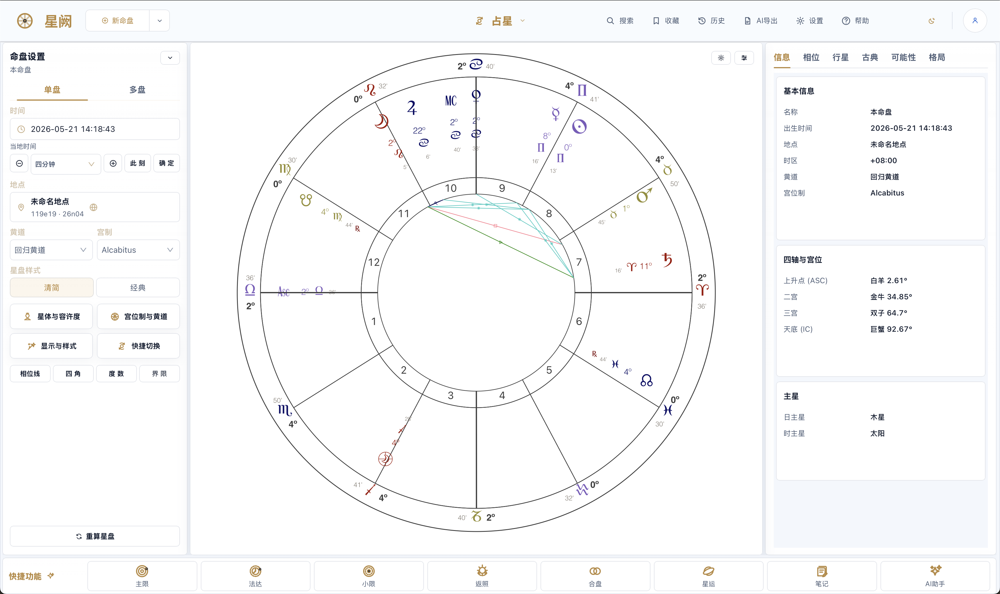
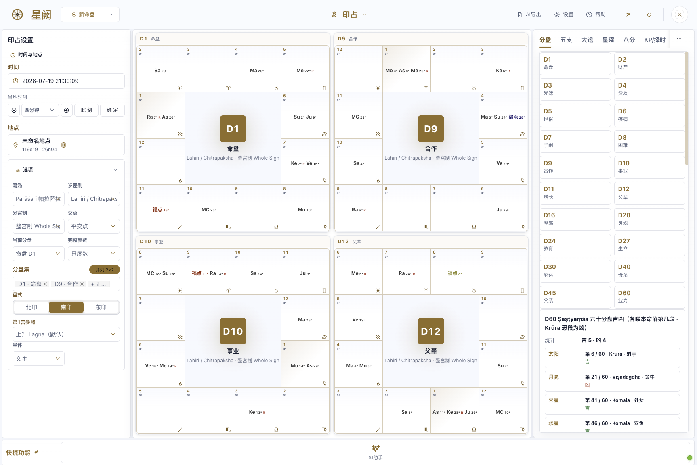
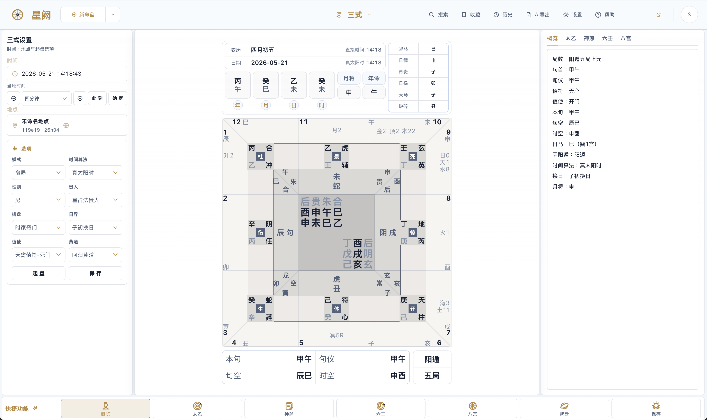
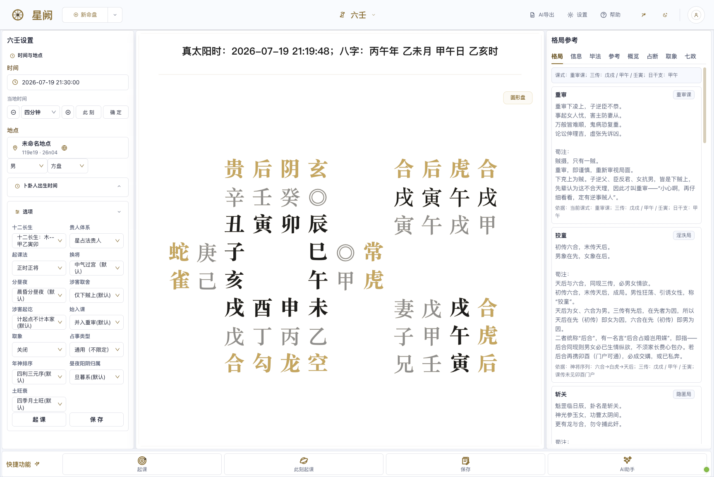
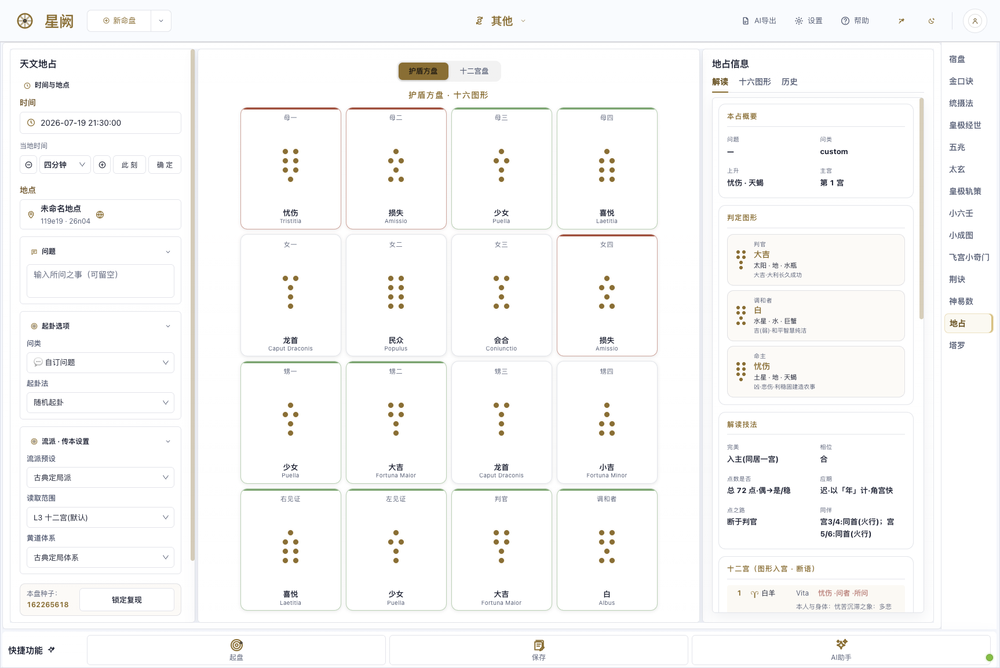
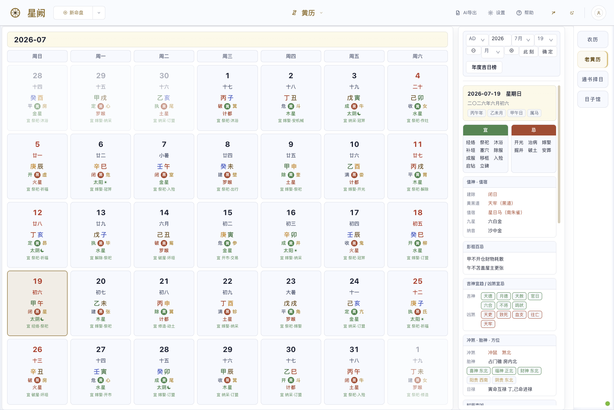

[简体中文](README_ZH.md) · English

# Horosa

**Western astrology and Chinese metaphysics, in one native Windows workstation**

Fate · Divination · Tools — **26 primary disciplines, 60+ sub-techniques & schools** (full catalog in [What's Inside](#whats-inside))

[Download](https://github.com/Horace-Maxwell/Horosa-Web-App-comprehensively-improved-Windows/releases/latest/download/Horosa-Setup-3.11.3.exe) ·
[Portal](README.md) ·
[中文说明](README_ZH.md) ·
[All Releases](https://github.com/Horace-Maxwell/Horosa-Web-App-comprehensively-improved-Windows/releases)

---

## What Horosa Is

Horosa is a desktop workstation for traditional cosmology. Western astrology—natal reading, the full timing chain, and relationship work—sits beside Chinese systems like Bazi, Ziwei, Qimen, Liuren, and Taiyi, all inside one native Windows application. The point is that you stop juggling a dozen single-purpose web tools, and you never hand-assemble the Python, Java, and ephemeris pieces underneath. You download an offline NSIS installer and open a finished app.

This repository is the Windows delivery of that app: the application source, the shared runtime, the Electron desktop shell, and the publishing flow that turns all of it into a single NSIS installer (`Horosa-Setup-3.11.3.exe`).

## Download

Regular users should go straight to the offline installer and open Horosa like any other Windows app.

**[⬇︎ Horosa-Setup-3.11.3.exe](https://github.com/Horace-Maxwell/Horosa-Web-App-comprehensively-improved-Windows/releases/latest/download/Horosa-Setup-3.11.3.exe)**

Best for:

- Windows 10 / 11 on `x64`
- weak-network or fully offline environments
- a first install, or forwarding the package to someone else
- anyone who wants the first launch to work without a separate runtime download

You do not need to install Python or Java yourself—the runtime ships inside the package. Updates replace the program and the shared runtime; they are not designed to touch your saved charts and cases.

- **Legal & privacy**: Terms of Service / Privacy Policy / Security / Network / Open-source notices — see [docs/legal](docs/legal/) (Chinese & English).

> The installer is not yet Authenticode-signed, so on first launch Windows SmartScreen may say "Windows protected your PC"—choose "More info → Run anyway" to continue; you can verify the installer against the official `SHA256SUMS.txt`.

## Screenshots

<table>
<tr>
<td width="50%"> <b>Astrology (Western natal)</b> — setup params & tradition presets on the left, chart canvas in the center, info / aspects / planets / classical / patterns tabs on the right.</td>
<td width="50%"> <b>BaZi (Four Pillars)</b> — simple / detailed / classical triple charts, Five-Element strength, structure & useful god, monthly command, luck / year / month / day cycles linked.</td>
</tr>
<tr>
<td width="50%"> <b>Vedic (Jyotish)</b> — D1–D60 divisional-chart grids side by side, South / North / East styles, Chitrapaksha ayanamsa, shashtiamsa dignities.</td>
<td width="50%"> <b>Primary Directions · Celestial Sphere</b> — ecliptic / equator / horizon / meridian / prime-vertical circles in 3D, event timeline indexed by age.</td>
</tr>
<tr>
<td width="50%"> <b>Astrocartography (ACG)</b> — planetary ASC / MC / DSC / IC lines projected on the world map, equidistant projection & multiple house systems.</td>
<td width="50%"> <b>Planetarium</b> — surface-observer / celestial-sphere dual mode, live stars, obliquity, sidereal time, Babylon 3D dome.</td>
</tr>
<tr>
<td width="50%"> <b>Three Rites in one</b> — Taiyi / Liuren / Qimen on one screen, nine-palace plate with overview / Taiyi / Liuren / Qimen / Ziwei-sihua tabs.</td>
<td width="50%"> <b>Qimen Dunjia</b> — hour-chart leap arrangement, nine-palace star / gate / spirit / stem, overview / spirits / eight-palace / resolution / useful-god tabs.</td>
</tr>
<tr>
<td width="50%"> <b>Da Liu Ren</b> — three transmissions & four lessons with the twelve generals, structure / bifa / judgment / imagery / seven-governors multi-school reading.</td>
<td width="50%"> <b>Liu Yao (Najia)</b> — original / changed / hidden / mutual hexagrams, self & response with changing lines, mounting / verdicts / query-type / text.</td>
</tr>
<tr>
<td width="50%"> <b>Astrological Geomancy</b> — sixteen shield-chart figures, four mothers / daughters / nieces / judge / reconciler, planet-in-house verdicts.</td>
<td width="50%"> <b>Almanac (Tongshu)</b> — daily do's & don'ts, day officers & lunar mansions, Peng Zu taboos, auspicious / inauspicious spirits, clash & fetal-spirit directions, date selection.</td>
</tr>
</table>

<em>The command overlay groups charts, Yi & Sanshi, and tools, with search and recents for fast switching.</em>

## What's Inside

The navigation organizes everything under three groups: **命** (charts & timing), **卜** (divination), and **工具** (tools). What follows is what each group actually ships—module names map directly to the in-app tabs.

As of v3.0.0, where schools disagree across the fate and divination sets the differences are surfaced as left-panel options whose defaults match prior results—the default chart path is byte-for-byte unchanged.

### Charts & Timing (命)

The strength here is continuity: you can read a natal chart, walk it forward through time, and bring in a second person, without leaving the same surface.

- **Astrology (占星)** — natal chart plus a real-time 3D chart (Babylon.js), with multiple house systems and classical/modern planet sets
- **Timing (星运)** — primary directions, zodiacal releasing, firdaria, profection, solar arc, solar and lunar returns, decennials, progressions, and an ephemeris
- **Relationship (合盘)** — compare, composite, synastry, time-space midpoint, and Marks charts
- **Specialty (辅盘)** — Hellenistic (bounds and lots), quantitative / midpoint trees (Hamburg / Uranian), astrocartography with interactive maps, and a harmonic lab
- **Vedic (印占)** — North, South, and East Indian charts on the sidereal zodiac
- **Qizheng (七政)** — Qizheng Siyu and Qizheng Moira
- **Bazi (八字) · Ziwei (紫微)** — four-pillar charting, and Purple Star including the Sihua chart
- **Numerology & more (数算 · 其他)** — Shaozi, Tieban, Yanqin and related numeric methods

### Divination (卜)

Yi and Sanshi go past standalone tabs into a genuinely integrated surface.

- **Sanshi United (三式)** — Qimen, Taiyi, and Liuren brought together: overview, Taiyi, shensha, Liuren, major patterns, sub-patterns, references, and the eight palaces
- **Qimen (遁甲) · Liuren (六壬) · Taiyi (太乙)** — each of the three formulae also as its own standalone surface
- **Liuyao (六爻) · Jieqi (分至) · Feng Shui (风水)** — najia hexagram casting, solar-term charts, and Feng Shui tools (six Li-Qi schools)
- **Tarot (塔罗) · Astronomical Geomancy (天文地占)** — tarot spreads with RWS / Egyptian / Marseille / Wirth card art, and astronomical geomancy
- **More (其他)** — Suzhao, Jinkou, Tongshefa, Huangji Jingshi, Wuzhao, Taixuan, Jingjue, and Shenyishu

### Tools (工具)

- **AI Analysis (AI 分析)** — connects to OpenAI, Anthropic, Gemini, Ollama, OpenRouter, or a custom endpoint; streaming chat, conversation history, a materials library with vector retrieval, mounting any technique's chart into the context, structured export grouped by technique and tab, and sectioned Bazi / Ziwei report generation
- **Xuanxue History (玄学史)** — a standalone page compiled from public-domain classics (the Twenty-Four Histories, Taiping Guangji, etc.): figures, stories, technique lineages, and celestial-event records across the dynasties, with an offline historical map, a force-directed figure-relationship graph, and a chronological timeline, searchable by dynasty / technique / figure and linked to charting
- **Planetarium (天文馆)** — a real-time 3D sky view built on Babylon.js, with complete Chinese asterisms, precise rise / set / culmination times, a lunar-mansion degree grid, and real-time sync during continuous time playback
- **Almanac (黄历)** — lunar calendar, solar terms, and date selection
- **References (辅助)** — gua-symbol classes, the twelve palaces, and quick rule lookups
- **Database (数据库)** — a built-in catalog of high-reliability celebrity charts (tens of thousands of A/AA birth records), fully offline with instant search and sign/category filtering; each entry opens a zodiac wheel and adds to your chart library in one click, ready to cast on any technique page

Charts and cases save locally with tags, snapshots, and raw backend payloads. Everything supports JSON import/export and restores its full state when you reopen it.

## Under the Hood

- **Frontend** — React 17 + Umi 3 + TypeScript with Ant Design; D3 for chart drawing, Babylon.js / Three.js for 3D, Plotly for astrocartography maps, and Monaco for editing AI-export templates
- **Backend** — Java 17 / Spring Boot hosts the core astrology and Chinese-method services; a Python 3.11 service layer wraps Swiss Ephemeris (`pyswisseph`) and the vendored kentang traditional-method engines
- **Desktop shell** — Electron, which starts the local Python/Java services in the background with health checks, and persists window, zoom, and settings state
- **Runtime** — the bundled Python is a pinned python-build-standalone build (reproducible and self-contained), shipped with the VC++ runtime, offline wheels, and the backend jar; a native-dependency gate and a pre-release preflight guard the build
- **Distribution** — an offline NSIS installer targeting Windows 10 / 11 (`x64`) with directory selection and upgrades; `latest.yml`, `.blockmap`, and `SHA256SUMS.txt` accompany the release

## Run the Web Version from Source

Skip the installer and run Horosa as a local web app straight from the source tree (for developers or anyone who prefers the source):

- **Start**: double-click `local\Horosa_Local_Windows.bat` in the repo — it opens the browser within seconds when a build already exists; on first run it auto-provisions the bundled Python / Java / Node runtime and builds (Mongo / Redis are optional for this product and skipped by default). It serves web `8000` / chart `8899` / backend `9999` on `127.0.0.1`, auto-switching to free ports if any are taken.
- **Stop**: return to the console window it opened and press Enter, or just close it (the script only reclaims processes carrying this product's fingerprint — it never touches other software). Set `HOROSA_NO_BROWSER=1` to skip auto-opening the browser.
- **First-run SmartScreen**: the unsigned script may trigger a Windows prompt — choose "More info → Run anyway".
- **Git Bash / WSL users**: the product source also ships `start_horosa_local.sh` / `stop_horosa_local.sh` (same services, cross-platform).

## FAQ

**Do I need to clone the repo to use Horosa?**
No. Download `Horosa-Setup-3.11.3.exe` from the latest release.

**Do I need to install Python or Java myself?**
No. The Windows installer carries the runtime the released app needs. The first launch is a little slower while those pieces are extracted and verified locally; later launches reuse the cache.

**Can I choose the install directory?**
Yes. The v2.2.0 Beta installer offers an assisted flow with directory selection, write checks, shortcut repair, and elevation when Windows requires it.

**Why are there other files in the release?**
`latest.yml`, `.blockmap`, and `SHA256SUMS.txt` support the updater and verification flows. For end users, `Horosa-Setup-3.11.3.exe` is the only thing that matters.

**Will updates remove my data?**
No. App replacement and runtime switching update the program and shared runtime; they are not designed to erase your saved charts and cases.

**Windows says "Windows protected your PC" (SmartScreen). Is the download unsafe?**
The installer is not Authenticode-signed, so SmartScreen shows an "Unknown publisher" notice on fresh downloads. Verify your download against `SHA256SUMS.txt` from the release page, then click **More info → Run anyway**. In-app updates are additionally protected by an Ed25519 signature check that refuses any tampered package.

**My antivirus quarantined part of the app, or it says a local service failed to start.**
Some antivirus products occasionally flag the bundled Python/Java runtime. Add the install folder and `%LOCALAPPDATA%\HorosaDesktop` to your antivirus allowlist, restore anything quarantined, and relaunch — or simply reinstall. When the app can tell, its error screen names the blocked directory so you know exactly what to allow.

**How much disk space do I need, and does the install path matter?**
Have at least 6 GB free when installing (~2 GB program, ~1.4 GB runtime extracted on first launch, plus caches). Keep the install path under 100 characters and avoid drive roots or system folders — the installer enforces both and suggests a dedicated folder such as `C:\Horosa`.

**Does Horosa work fully offline?**
Yes. Every computation runs locally; no internet is needed to install or use it. The network is only touched to check GitHub for updates — if that is unreachable, the app simply keeps working, and you can update manually by downloading a newer installer. (Advanced: the `HOROSA_UPDATE_FEED_URL` environment variable points the updater at a custom feed.)

**Does it run on ARM laptops (Snapdragon)?**
Windows 11 on ARM runs Horosa through the system's built-in x64 emulation — fully functional, slightly slower than native x64. Windows 10 on ARM has no x64 emulation and is not supported; the installer detects this and says so instead of leaving a broken install.

**Does it work on Windows S-mode or company-managed PCs?**
Windows S-mode only allows Microsoft Store apps and blocks side-loaded installers (including Horosa's setup itself) — a system-level restriction; switch out of S-mode (Settings → Activation) before installing. Enterprise AppLocker / software-restriction policies behave the same way; ask your IT admin to allow the app.

**Does my Windows display language or region affect anything?**
No. Install and use are locale-independent by design: any system language, Turkish/Thai/Arabic regional settings, legacy GBK/Shift-JIS code pages, the "Beta: UTF-8 worldwide" option, and non-ASCII Windows user names all work. Blocking installer errors are shown in Chinese plus a short English line.

## For Maintainers

Start from the entry point that matches your goal:

- public-facing layout and bilingual portal: [README.md](README.md)
- the full Chinese guide: [README_ZH.md](README_ZH.md)
- third-party licensing: [THIRD_PARTY_NOTICES.md](local/workspace/Horosa-Web-55c75c5b088252fbd718afeffa6d5bcb59254a0c/THIRD_PARTY_NOTICES.md)
- legal & privacy documents: [docs/legal](docs/legal/)
- product source: [`local/workspace/Horosa-Web-…/`](local/workspace/Horosa-Web-55c75c5b088252fbd718afeffa6d5bcb59254a0c/) — frontend `astrostudyui`, backends `astrostudysrv` / `astropy`, engines `vendor`, ephemeris `flatlib-ctrad2`
- runtime-prep scripts (with bundled VC++ runtime): [`prepareruntime/`](prepareruntime/)
- Windows adaptation layer (Windows-only patches and release sentinels): [`windows-adaptations/`](windows-adaptations/)
- release history & full notes: [GitHub Releases](https://github.com/Horace-Maxwell/Horosa-Web-App-comprehensively-improved-Windows/releases)

## Acknowledgements

The lineage matters. Horosa was originally created by **郑大哥**, with auxiliary design work by **荀爽 (Herakleios, 爽哥)**, who released the App and Web versions that made later study, maintenance, and extension possible. This Windows edition builds on that groundwork—adding the delivery layer, runtime packaging, integration, and a great deal of polish—and it would not exist without them. Thanks, too, to everyone who keeps testing, reporting, and fixing things to make Horosa more complete.

Special thanks to [kentang2017](https://github.com/kentang2017), whose long-running, openly shared Python projects power several of Horosa's calculation engines. Upstream projects identified as MIT-licensed retain their license texts in the corresponding vendored directories and `THIRD_PARTY_NOTICES.md`; projects without an explicit open-source license are listed separately, so no license is assumed where none was declared.
